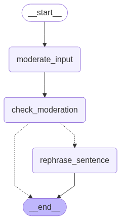

# Rephrase Agent

This project provides a text rephrasing application powered by LangGraph, LangChain, and Streamlit.  
It takes user input, checks for moderation compliance, and rephrases it into multiple tones — professional, casual, polite, and social-media-friendly.

---

## Features

- **Content Moderation**: Detects inappropriate content before processing.
- **Multi-tone Rephrasing**: Generates four different versions of the input text.
- **Interactive UI**: Streamlit interface for easy text input and visualization.
- **Containerized Deployment**: Docker support for quick setup and portability.

---

## How It Works
The application is built around a LangGraph workflow

### Diagram


- Moderate Input: Uses an LLM to check if content is safe.

- Check Moderation: Decides whether to stop or proceed.

- Rephrase Sentence: Generates different tone variations.

- End: Returns final output to the user.

---

## Setup Instructions

### 1. Clone the Repository
```bash
git clone <your-repo-url>
cd <your-repo-folder>
```

### 2. Create and Activate a Virtual Environment
```bash
python -m venv venv
source venv/bin/activate    # Mac/Linux
venv\Scripts\activate       # Windows
```
### 3. Install Dependencies
```bash
pip install -r requirements.txt
```
### 4. Set Environment Variables
Create a .env file in the project root:
```bash
OPENAI_API_KEY="your-openai-api-key"
```

---

## Running the Application
### Option 1 — Local Run
```bash
streamlit run app.py
```
Open your browser and go to:
```bash
http://localhost:8501
```
### Option 2 — Docker Run
Build the Docker image:
```bash
docker build -t rephrase-agent .
```
Run the container:
```bash
docker run -p 8501:8501 --name rephrase-app  rephrase-app
```

---

## Tech Stack

- Python 3.12

- Streamlit — UI framework

- LangGraph — Workflow orchestration

- LangChain — LLM integration

- Docker — Containerization

